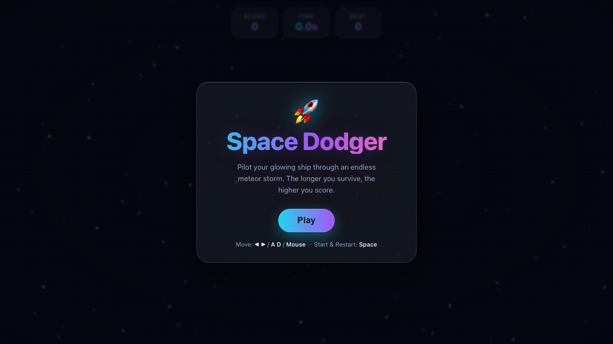

# 🚀 Space Dodger

یک بازی آرکید بقای سریع و نئونی که در آن یک کشتی درخشان را از میان یک طوفان بی‌پایان شهاب‌سنگی هدایت می‌کنی.

🎮 **بازی آنلاین:** https://gamelabz.github.io/html5-game-space-dodger/

## 📸 تصویر بازی



## 🎯 درباره بازی

**Space Dodger** یک بازی آرکید بقای بی‌پایان است که با HTML5 Canvas خالص و جاوااسکریپت ونیلا ساخته شده — بدون فریم‌ورک، بدون مرحله ساخت و بدون درخواست شبکه. تو یک کشتی ظریف و درخشان را نزدیک پایین صفحه کنترل می‌کنی و باید از میان یک میدان شهاب‌سنگی بی‌رحم که به‌صورت تصادفی تولید می‌شود عبور کنی. هرچه بیشتر زنده بمانی، طوفان سریع‌تر و فشرده‌تر می‌شود و امتیازت هر ثانیه بالا می‌رود. با نزدیک‌ترین عبورها امتیازِ پاداش بگیر، رکورد شخصی‌ات را دنبال کن و به میدان ستاره‌های فضای عمیق پشت پنل‌های HUD شیشه‌ای (گلس‌مورفیسم) خیره شو.

## 🕹️ کنترل‌ها

- **کلیدهای جهت‌دار ◀ / ▶** یا **A / D** — حرکت کشتی به چپ و راست.
- **ماوس / لمس** — هدایت کشتی با حرکت نشانگر.
- **Space / Enter** — شروع بازی یا شروع مجدد پس از برخورد.

## ✨ ویژگی‌ها

- **گیم‌پلی بی‌پایان** با سختی نرم و زمان‌بندی‌شده (شهاب‌سنگ‌های سریع‌تر و فشرده‌تر).
- **میدان شهاب‌سنگی تصادفی** — هر بار بازی متفاوت است، با سیارک‌های چرخان و نامنظم.
- **امتیاز پاداش نزدیک‌مرور** — از کنار یک شهاب‌سنگ عبور کن تا امتیاز اضافه و لرزش صفحه رضایت‌بخش بگیری.
- **HUD گلس‌مورفیسم** با نمایش زنده امتیاز، زمان و بهترین رکورد.
- **جلوه‌های چشم‌نواز** — کشتی و شهاب‌سنگ‌های درخشان، ذرات دنباله موتور، انفجار و سیستم لرزش صفحه.
- **ذخیره بهترین امتیاز** در `localStorage`.
- **کاملاً خودکفا** — میدان ستاره‌ای متحرک تاریک، پالت یکپارچه و بدون هیچ منبع یا فونت خارجی.

## 🚀 اجرا در محیط محلی

نصبی لازم نیست. بازی را مستقیماً در مرورگر باز کن:

```bash
# روش اول: باز کردن مستقیم فایل
open index.html

# روش دوم: سرویس با یک سرور استاتیک کوچک
npx serve .
```

سپس به نشانی چاپ‌شده مراجعه کن (پیش‌فرض `http://localhost:3000`).

## 🛠️ تکنولوژی

- HTML5 `<canvas>`
- CSS3 (متغیرهای سفارشی، flexbox، گلس‌مورفیسم، `backdrop-filter`)
- جاوااسکریپت خالص (ES2020، بدون فریم‌ورک)

## 🤝 مشارکت

از مشارکت استقبال می‌شود! برای همکاری:

1. مخزن را فورک کن.
2. یک شاخه جدید بساز (`git checkout -b feature/my-idea`).
3. تغییرات را کامیت کن (`git commit -m "Add my idea"`).
4. به شاخه پوش کن (`git push origin feature/my-idea`).
5. یک Pull Request باز کن.

لطفاً بازی را بدون وابستگی نگه دار و قبل از ارسال در مرورگر تستش کن.

## 📄 لایسنس

این پروژه تحت [لایسنس MIT](LICENSE) منتشر شده است — یک لایسنس نرم‌افزار آزاد و متن‌باز.

---

بیا با هم چیزی بسازیم 🚀
https://tally.so/r/q4q1L9
